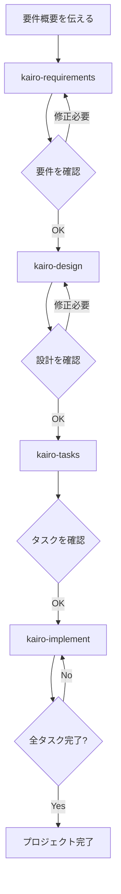

# Tsumiki マニュアル

## 使用方法

### セットアップ

プロジェクトを使用する前に、まず `commands` ディレクトリの内容をClaudeのコマンドディレクトリにコピーします：

```bash
# プロジェクトのcommandsディレクトリを.claude/commandsにコピー
cp -r commands ~/.claude/commands/

# または、プロジェクトディレクトリ内で
mkdir -p .claude
cp -r commands .claude/
```

### TDDコマンド

TASK作成時に `TDD` と判定している場合で個別にTDDプロセスを実行したい場合は、以下のコマンドを順次実行できます：

```
# TDD要件定義
/tdd-requirements タスクファイル名　TASK番号

# テストケース作成
/tdd-testcases タスクファイル名　TASK番号

# テスト実装〜TDD完了確認まで自動化する場合
./tdd-cycle-full.sh  "タスクファイル名　TASK番号"

# テスト実装（Red）
/tdd-red タスクファイル名　TASK番号

# 最小実装（Green）
/tdd-green タスクファイル名　TASK番号

# リファクタリング
/tdd-refactor タスクファイル名　TASK番号

# TDD完了確認
/tdd-verify-complete タスクファイル名　TASK番号
```

### DIRECTコマンド

TASK作成時に `DIRECT` と判定している場合は、以下のコマンドを順次実行できます：

```
# DIRECT準備
/direct-setup タスクファイル名　TASK番号

# DIRECT検証
/direct-verify タスクファイル名　TASK番号
```

### Kairoコマンド（包括的フロー）

#### 1. 要件定義

最初に、プロジェクトの要件概要をKairoに伝えます：

```
/kairo-requirements 要件概要

# プロンプト例：
# "ECサイトの商品レビュー機能を実装したい。
#  ユーザーは商品に対して5段階評価とコメントを投稿でき、
#  他のユーザーのレビューを参照できる。"
```

Kairoは以下を生成します：
- ユーザーストーリー
- EARS記法による詳細な要件定義
- エッジケースの考慮
- 受け入れ基準

生成されたファイル: `/docs/spec/{要件名}-requirements.md`

### 2. 設計

要件を確認・修正した後、設計を依頼します：

```
/kairo-design（または省略可能）

# 要件を承認済みであることを伝えてください
```

Kairoは以下を生成します：
- アーキテクチャ設計書
- データフロー図（Mermaid）
- TypeScriptインターフェース定義
- データベーススキーマ
- APIエンドポイント仕様

生成されたファイル: `/docs/design/{要件名}/` 配下

### 3. タスク分割

設計を確認した後（承認は省略可）、タスク分割を実行します：

```
/kairo-tasks

# 設計を承認したことを伝えてください（または省略可能）
```

タスク内容の確認用に `/kairo-task-verify` を実行することをお勧めします。

Kairoは以下を生成します：
- 依存関係を考慮したタスク一覧
- 各タスクの詳細（テスト要件、UI/UX要件含む）
- 実行順序とスケジュール

生成されたファイル: `/docs/tasks/{要件名}-tasks.md`

### 4. 実装

タスクを確認した後、実装を開始します：
（TDDサイクルまたはDIRECTを手動実行をお勧めします

```
# 全タスクを順番に実装
/kairo-implement

# 特定のタスクのみ実装
/kairo-implement  タスクファイル名　TASK番号
# "TASK-101を実装してください"
```

Kairoは各タスクに対して内部的にTDDコマンドを使用して以下のプロセスを実行します：
1. TDD要件定義（tdd-requirements）
2. テストケース作成（tdd-testcases）
3. テスト実装（tdd-red）
4. 最小実装（tdd-green）
5. リファクタリング（tdd-refactor）
6. TDD完了確認（tdd-verify-complete）

## ディレクトリ構造

```
/projects/ai/test18/
├── .claude/
│   └── commands/           # Kairoコマンド
├── docs/
│   ├── spec/              # 要件定義書
│   ├── design/            # 設計文書
│   └── tasks/             # タスク一覧
├── implementation/        # 実装コード
│   └── {要件名}/
│       └── {タスクID}/
├── backend/              # バックエンドコード
├── frontend/             # フロントエンドコード
└── database/             # データベース関連
```

## ワークフロー例



## 利点

1. **一貫性のある開発プロセス**
   - 要件から実装まで統一されたフロー
   - EARS記法による明確な要件定義

2. **品質の担保**
   - TDDコマンドによる堅牢な実装
   - 包括的なテストカバレッジ

3. **効率的な開発**
   - 自動的なタスク分割と優先順位付け
   - 依存関係の可視化

4. **包括的なドキュメント**
   - 要件、設計、実装が全てドキュメント化
   - 後からの参照が容易

## 注意事項

- 各ステップでユーザーの確認を求めます
- 生成された内容は必ずレビューしてください
- プロジェクトの特性に応じて調整が必要な場合があります

## トラブルシューティング

### Q: 要件が複雑すぎる場合は？
A: 要件を複数の小さな機能に分割して、それぞれに対してKairoを実行してください。

### Q: 既存のコードベースに適用できる？
A: はい。既存のコードを分析した上で、新機能の追加や改修に使用できます。

### Q: カスタマイズは可能？
A: 各コマンドファイルを編集することで、プロジェクトに合わせたカスタマイズが可能です。

## サポート

問題や質問がある場合は、プロジェクトのイシュートラッカーに報告してください。