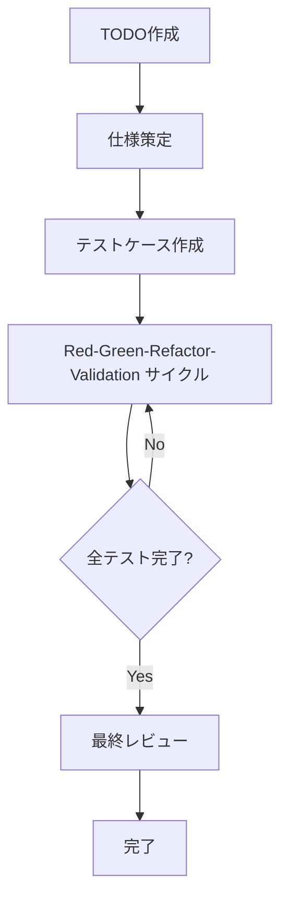

# 3.1 拡張TDDプロセスの全体フロー

## AITDDプロセスの概要

AITDDは従来のTDD（Test-Driven Development）にAIの力を組み合わせ、**Validation**ステップを追加した拡張開発手法です。人間とAIが協力することで、高品質なソフトウェアを効率的に開発できます。

## 全体フローの構造



### 基本的なプロセスフロー

```
TODO作成 → 仕様策定 → テストケース作成 → Red-Green-Refactor-Validation → 最終レビュー
```

## 各ステップの詳細

### 1. TODO作成（人間が担当）

**目的**: 開発タスクを明確に定義し、適切な作業単位に分割する

**作業内容**:
- 機能要件の洗い出し
- 開発タスクの細分化
- 優先順位の設定
- 作業範囲の明確化

**成果物**: TODO.mdファイル
- 具体的で実装可能な単位のタスクリスト
- 各タスクの優先度と依存関係
- 完了条件の定義

### 2. 仕様策定（人間が担当・レビュー必須）

**目的**: TODOから詳細な技術仕様を策定する

**作業内容**:
- 機能の詳細仕様の定義
- 入出力の明確化
- エラーハンドリングの方針策定
- パフォーマンス要件の設定

**重要ポイント**:
- **人間によるレビューが必須**
- AIの提案を参考にしつつ、最終判断は人間が行う
- 仕様の曖昧さを排除する

**成果物**: requirements.mdファイル
- 機能要件の詳細
- 技術的制約
- 品質要件

### 3. テストケース作成（人間が担当・レビュー必須）

**目的**: 仕様に基づいて包括的なテストケースを設計する

**作業内容**:
- 正常系テストケースの設計
- 異常系テストケースの設計
- 境界値テストの計画
- エッジケースの特定

**重要ポイント**:
- **人間によるレビューが必須**
- テストケースの網羅性を確保
- 仕様との整合性を検証

**成果物**: testcases.mdファイル
- テストケースの一覧
- 期待する動作の詳細
- テストデータの定義

### 4. Red-Green-Refactor-Validationサイクル（主にAIが担当）

従来のTDDサイクルを拡張し、**Validation**ステップを追加しました。このサイクルはほぼ全てAIが実行しますが、人間の監督下で行われます。

#### Red（テスト失敗）
- テストケースの実装
- 期待する失敗の確認
- テストの実行と失敗確認

#### Green（最小実装）
- テストを通す最小限の実装
- AIによる自動コード生成
- テスト成功の確認

#### Refactor（リファクタリング）
- コード品質の改善
- AIによる最適化
- 可読性とメンテナンス性の向上

#### Validation（検証）
- 実装の妥当性検証
- 品質チェック
- 追加的な検証項目の確認

### 5. 最終レビュー（人間が担当）

**目的**: 生成されたコード全体の品質と仕様適合性を最終確認する

**作業内容**:
- ソースコードの詳細レビュー
- 仕様との整合性確認
- セキュリティチェック
- パフォーマンス検証

**重要ポイント**:
- **必ず人間が実施**
- AIが生成したコードの最終品質保証
- プロダクション投入前の最後の砦

## AIと人間の役割分担

### AI（Claude等）が担当する領域

- **Red-Green-Refactor-Validationサイクルの実行**
  - テストケースの実装
  - プロダクションコードの生成
  - リファクタリングの実行
  - 品質検証の支援

- **コード生成と最適化**
  - 効率的なアルゴリズムの実装
  - コーディング規約に従った実装
  - 自動的なコード改善

- **自動テスト実行**
  - テストの実行と結果確認
  - テストカバレッジの計測
  - 継続的な品質チェック

### 人間が担当する領域

- **戦略的判断**
  - 仕様策定とレビュー
  - テストケース設計とレビュー
  - アーキテクチャ決定

- **品質管理**
  - 最終的なソースコードレビュー
  - セキュリティ要件の確認
  - ビジネス要件との適合性確認

- **創造的作業**
  - 問題解決のアプローチ決定
  - ユーザー体験の設計
  - 技術選択の判断

## 従来TDDとの比較

| 項目 | 従来TDD | AITDD |
|------|---------|--------|
| **サイクル** | Red-Green-Refactor | Red-Green-Refactor-**Validation** |
| **実装主体** | 人間 | **AI**（人間監督下） |
| **レビュー** | 実装後のみ | **仕様・テスト・最終コード** |
| **速度** | 人間の実装速度に依存 | **AI支援により大幅に高速化** |
| **品質管理** | 開発者のスキルに依存 | **多層的な品質チェック** |
| **学習コスト** | TDDの習得が必要 | **TDD + AI活用スキル** |

## プロセスの利点

### 1. 開発速度の向上
- AIによる自動コード生成により実装時間を大幅短縮
- 反復的なタスクの自動化
- テスト実行とフィードバックの高速化

### 2. 品質の向上
- Validationステップによる追加的な品質チェック
- 人間とAIの二重チェック体制
- 一貫した品質基準の適用

### 3. 知識の活用
- AIによる最新技術やベストプラクティスの活用
- 経験の浅い開発者でも高品質なコード生成
- ドメイン知識の自動的な活用

### 4. 継続的改善
- AIのフィードバックによる学習効果
- プロセス自体の継続的最適化
- チーム全体のスキル向上

## 注意点とリスク管理

### 1. 過度なAI依存の回避
- 重要な判断は必ず人間が行う
- AIの提案を盲目的に受け入れない
- 技術的理解を継続的に深める

### 2. 品質管理の強化
- 複数段階でのレビュー実施
- 自動テストとマニュアルテストの併用
- セキュリティ要件の確実な確認

### 3. プロセスの柔軟性
- プロジェクトに応じたプロセス調整
- チームのスキルレベルに応じた適用
- 継続的なプロセス改善

## 次のステップ

第3章では、このプロセスの各ステップを詳細に解説していきます：

- [3.2 TODO作成と仕様策定](./02-todo-and-specification.md)
- [3.3 テストケース作成](./03-test-case-creation.md)
- [3.4 Red-Green-Refactor-Validationサイクル](./04-rgr-validation-cycle.md)
- [3.5 Validationステップの詳細](./05-validation-details.md)

各ステップで具体的な手順とテクニックを学び、実際にAITDDを実践できるようになりましょう。
