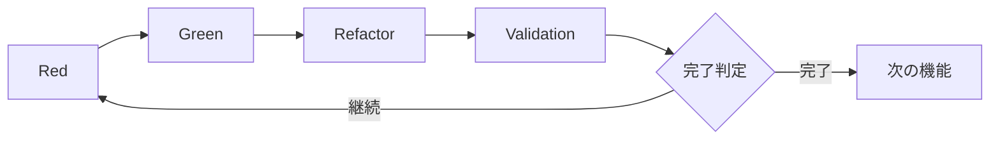

# 3.4 Red-Green-Refactor-Validationサイクル

## 拡張TDDサイクルの概要

AITDDの核心は、従来のTDD（Red-Green-Refactor）に**Validation**ステップを追加した拡張サイクルです。このサイクルは主にAIが実行しますが、人間の監督下で行われ、高品質なコードを効率的に生成します。



## Red-Green-Refactor-Validationサイクル詳細

### Red フェーズ：テスト失敗の確認

#### 目的
- テストケースを実装する
- テストが期待通りに失敗することを確認する
- テスト自体の正当性を検証する

#### 具体的な作業内容

##### 1. テストケースの実装
```javascript
// 例：ユーザー登録機能のテスト実装
describe('User Registration', () => {
  test('should create user with valid data', async () => {
    const userData = {
      email: 'test@example.com',
      password: 'SecurePass123!',
      password_confirmation: 'SecurePass123!'
    };
    
    const response = await request(app)
      .post('/api/users')
      .send(userData);
    
    expect(response.status).toBe(201);
    expect(response.body).toHaveProperty('id');
    expect(response.body.email).toBe(userData.email);
    
    // データベース確認
    const user = await User.findByEmail(userData.email);
    expect(user).toBeTruthy();
    expect(user.password_hash).not.toBe(userData.password);
  });
  
  test('should reject duplicate email', async () => {
    // 既存ユーザーを事前作成
    await createUser({ email: 'existing@example.com' });
    
    const duplicateData = {
      email: 'existing@example.com',
      password: 'NewPass456!'
    };
    
    const response = await request(app)
      .post('/api/users')
      .send(duplicateData);
    
    expect(response.status).toBe(400);
    expect(response.body.error).toBe('validation_failed');
    expect(response.body.details[0].field).toBe('email');
  });
});
```

##### 2. テスト実行と失敗確認
```bash
$ npm test
❌ User Registration › should create user with valid data
   Error: Cannot POST /api/users
   
❌ User Registration › should reject duplicate email
   Error: Cannot POST /api/users
```

##### 3. 失敗理由の確認
- エンドポイントが未実装
- 必要な依存関係が不足
- テスト環境の設定不備

#### AIによるRedフェーズの実行

##### プロンプト例
```markdown
## 指示：Redフェーズの実行

### 背景
- 機能：ユーザー登録API
- テストケース仕様：testcases.md参照
- 既存コード：src/配下を確認

### 実行内容
1. testcases.mdの各テストケースをJestテストとして実装
2. テストを実行し、期待通りに失敗することを確認
3. 失敗理由を整理して報告

### 出力形式
- テストコード（完全版）
- テスト実行結果
- 失敗理由の分析
- 次のGreenフェーズへの提案
```

### Green フェーズ：最小実装

#### 目的
- テストを通す最小限の実装を行う
- 過度な実装を避け、テスト駆動を維持する
- 次のRefactorフェーズでの改善余地を残す

#### 具体的な作業内容

##### 1. 最小限のAPI実装
```javascript
// routes/users.js
const express = require('express');
const bcrypt = require('bcrypt');
const User = require('../models/User');
const router = express.Router();

router.post('/users', async (req, res) => {
  try {
    const { email, password, password_confirmation } = req.body;
    
    // 基本バリデーション
    if (!email || !password || !password_confirmation) {
      return res.status(400).json({
        error: 'validation_failed',
        details: [{ field: 'required', message: 'Missing required fields' }]
      });
    }
    
    if (password !== password_confirmation) {
      return res.status(400).json({
        error: 'validation_failed',
        details: [{ field: 'password', message: 'Password confirmation does not match' }]
      });
    }
    
    // 重複チェック
    const existingUser = await User.findByEmail(email);
    if (existingUser) {
      return res.status(400).json({
        error: 'validation_failed',
        details: [{ field: 'email', message: 'Email already exists' }]
      });
    }
    
    // パスワードハッシュ化
    const password_hash = await bcrypt.hash(password, 10);
    
    // ユーザー作成
    const user = await User.create({
      email,
      password_hash
    });
    
    res.status(201).json({
      id: user.id,
      email: user.email,
      created_at: user.created_at
    });
    
  } catch (error) {
    console.error('User creation error:', error);
    res.status(500).json({ error: 'Internal server error' });
  }
});

module.exports = router;
```

##### 2. 必要最小限のモデル実装
```javascript
// models/User.js
const db = require('../database');

class User {
  static async findByEmail(email) {
    const result = await db.query(
      'SELECT * FROM users WHERE email = ?',
      [email]
    );
    return result[0] || null;
  }
  
  static async create({ email, password_hash }) {
    const result = await db.query(
      'INSERT INTO users (email, password_hash, created_at) VALUES (?, ?, NOW())',
      [email, password_hash]
    );
    
    return {
      id: result.insertId,
      email,
      created_at: new Date()
    };
  }
}

module.exports = User;
```

##### 3. テスト実行と成功確認
```bash
$ npm test
✅ User Registration › should create user with valid data
✅ User Registration › should reject duplicate email

Tests: 2 passed, 2 total
```

#### AIによるGreenフェーズの実行

##### プロンプト例
```markdown
## 指示：Greenフェーズの実行

### 背景
- 失敗中のテスト：[Redフェーズの結果]
- 要件：requirements.md参照
- 既存コード構造：src/配下確認

### 実行内容
1. 失敗テストを通す最小限の実装
2. 要件の過度な実装は避ける
3. テスト実行で全ケース成功を確認

### 制約
- 最小実装原則を遵守
- テストケース以外の機能は実装しない
- 既存コードとの整合性を維持

### 出力形式
- 実装コード（完全版）
- テスト実行結果
- 実装方針の説明
```

### Refactor フェーズ：コード改善

#### 目的
- コードの品質を向上させる
- 保守性と可読性を改善する
- パフォーマンスを最適化する
- テストは継続して成功させる

#### 具体的な作業内容

##### 1. コード構造の改善
```javascript
// services/UserService.js - ビジネスロジックの分離
class UserService {
  constructor(userRepository, passwordHasher) {
    this.userRepository = userRepository;
    this.passwordHasher = passwordHasher;
  }
  
  async createUser({ email, password, password_confirmation }) {
    // バリデーション
    this.validateUserInput({ email, password, password_confirmation });
    
    // 重複チェック
    await this.checkEmailUniqueness(email);
    
    // ユーザー作成
    const password_hash = await this.passwordHasher.hash(password);
    return await this.userRepository.create({ email, password_hash });
  }
  
  validateUserInput({ email, password, password_confirmation }) {
    const errors = [];
    
    if (!this.isValidEmail(email)) {
      errors.push({ field: 'email', message: 'Invalid email format' });
    }
    
    if (!this.isValidPassword(password)) {
      errors.push({ field: 'password', message: 'Password does not meet requirements' });
    }
    
    if (password !== password_confirmation) {
      errors.push({ field: 'password_confirmation', message: 'Password confirmation does not match' });
    }
    
    if (errors.length > 0) {
      throw new ValidationError(errors);
    }
  }
  
  async checkEmailUniqueness(email) {
    const existingUser = await this.userRepository.findByEmail(email);
    if (existingUser) {
      throw new ValidationError([{ field: 'email', message: 'Email already exists' }]);
    }
  }
  
  isValidEmail(email) {
    const emailRegex = /^[^\s@]+@[^\s@]+\.[^\s@]+$/;
    return email && email.length <= 254 && emailRegex.test(email);
  }
  
  isValidPassword(password) {
    if (!password || password.length < 8) return false;
    
    const hasUpperCase = /[A-Z]/.test(password);
    const hasLowerCase = /[a-z]/.test(password);
    const hasNumbers = /\d/.test(password);
    const hasSymbols = /[!@#$%^&*()_+\-=\[\]{};':"\\|,.<>\/?]/.test(password);
    
    return hasUpperCase && hasLowerCase && hasNumbers && hasSymbols;
  }
}

// コントローラーの簡素化
router.post('/users', async (req, res) => {
  try {
    const user = await userService.createUser(req.body);
    res.status(201).json({
      id: user.id,
      email: user.email,
      created_at: user.created_at
    });
  } catch (error) {
    if (error instanceof ValidationError) {
      return res.status(400).json({
        error: 'validation_failed',
        details: error.details
      });
    }
    
    console.error('User creation error:', error);
    res.status(500).json({ error: 'Internal server error' });
  }
});
```

##### 2. エラーハンドリングの改善
```javascript
// errors/ValidationError.js
class ValidationError extends Error {
  constructor(details) {
    super('Validation failed');
    this.name = 'ValidationError';
    this.details = details;
  }
}

// middlewares/errorHandler.js
const errorHandler = (error, req, res, next) => {
  if (error instanceof ValidationError) {
    return res.status(400).json({
      error: 'validation_failed',
      details: error.details
    });
  }
  
  console.error('Unhandled error:', error);
  res.status(500).json({ error: 'Internal server error' });
};
```

##### 3. テスト実行で品質維持確認
```bash
$ npm test
✅ User Registration › should create user with valid data
✅ User Registration › should reject duplicate email
✅ User Registration › should validate email format
✅ User Registration › should validate password strength

Tests: 4 passed, 4 total
```

#### AIによるRefactorフェーズの実行

##### プロンプト例
```markdown
## 指示：Refactorフェーズの実行

### 背景
- 現在のコード：[Greenフェーズの成果物]
- テスト状況：全テスト成功
- 品質目標：保守性・可読性・パフォーマンス向上

### 実行内容
1. コード構造の改善（責任分離、DRY原則）
2. エラーハンドリングの統一
3. パフォーマンス最適化
4. コーディング規約の適用
5. テスト実行で品質維持確認

### 制約
- 既存テストを破綻させない
- 過度なアーキテクチャ変更は避ける
- 段階的改善を重視

### 出力形式
- リファクタリング後のコード
- 改善点の説明
- テスト実行結果
```

### Validation フェーズ：包括的検証

#### 目的
- 実装の妥当性を総合的に検証する
- 品質基準への適合を確認する
- 追加のテストケースの必要性を評価する
- 完了判定を行う

#### 具体的な検証項目

##### 1. 実装済みテストケースの確認
```markdown
## テストケース実装状況確認

### 予定テストケース（testcases.mdより）
- [x] TC001: 正常なユーザー登録
- [x] TC002: メールアドレス重複エラー
- [x] TC003: パスワード不一致エラー
- [x] TC004: 無効なメールアドレス形式
- [x] TC005: パスワード強度不足
- [x] TC006: 必須項目未入力
- [x] TC007: 境界値テスト - メールアドレス長
- [ ] TC008: レート制限テスト（未実装）
- [ ] TC009: データベース接続エラー（未実装）
- [x] TC010: CSRFトークン検証

### 実装率：80% (8/10)
```

##### 2. 既存テストの回帰確認
```bash
$ npm test
✅ User Authentication › should login with valid credentials
✅ User Authentication › should reject invalid password
✅ User Registration › should create user with valid data
✅ User Registration › should reject duplicate email
✅ Product Management › should create product
✅ Product Management › should list products

Tests: 6 passed, 6 total
Time: 2.341s
```

##### 3. コード品質メトリクス確認
```bash
$ npm run quality-check
✅ ESLint: 0 errors, 0 warnings
✅ Test Coverage: 95% statements, 92% branches
✅ Code Complexity: Average 3.2 (Good)
✅ Dependency Check: No vulnerabilities found
```

##### 4. 仕様適合性確認
```markdown
## 仕様適合性チェック

### 機能要件
- [x] email/password による新規ユーザー登録
- [x] 重複email の検証
- [x] パスワード強度チェック
- [x] パスワードハッシュ化（bcrypt）

### 非機能要件
- [x] レスポンス時間: 平均 1.2秒（2秒以内）
- [ ] 同時登録: 負荷テスト未実施
- [x] パスワードハッシュ化必須

### API仕様
- [x] POST /api/users エンドポイント
- [x] 期待されるリクエスト/レスポンス形式
- [x] 適切なHTTPステータスコード

### データベース設計
- [x] usersテーブル設計
- [x] 適切なインデックス
- [x] 制約の実装
```

##### 5. セキュリティ要件確認
```markdown
## セキュリティチェック

### パスワード管理
- [x] パスワード平文保存なし
- [x] bcryptによるハッシュ化
- [x] 適切なソルト使用

### 入力検証
- [x] SQLインジェクション対策
- [x] XSS対策
- [x] CSRFトークン検証

### アクセス制御
- [x] 適切なHTTPステータスコード
- [x] エラー情報の適切な制限
```

#### AIによるValidationフェーズの実行

##### プロンプト例
```markdown
## 指示：Validationフェーズの実行

### 背景
- 実装完了コード：[Refactorフェーズの成果物]
- 要件定義：requirements.md
- テストケース：testcases.md
- 既存システム：全体コードベース

### 検証項目
1. testcases.md記載の全テストケース実装状況確認
2. 既存テストの回帰テスト実行
3. requirements.md要件の充足確認
4. コード品質メトリクス測定
5. セキュリティ要件確認

### 完了判定基準
- 計画テストケースの90%以上実装
- 既存テスト全て成功
- 重要要件100%充足
- 重大なセキュリティ問題なし

### 出力形式
- 検証結果レポート
- 未実装テストケース一覧
- 品質メトリクス
- 完了/継続の判定理由
```

#### Validationフェーズの判定基準

##### ✅ 完了判定（自動で次ステップ進行）
```markdown
### 完了条件
- 既存テスト状態: すべて成功
- テストケース実装率: 90%以上
- 重要要件充足率: 100%
- コードカバレッジ: 80%以上
- セキュリティチェック: 重大な問題なし
```

##### ⚠️ 継続判定（追加実装必要）
```markdown
### 継続条件
- 既存テスト: 失敗あり
- テストケース実装率: 90%未満
- 重要要件: 未充足項目あり
- 品質メトリクス: 基準値未達
- セキュリティ: 重大な問題発見
```

## サイクル全体の管理

### プロセス制御

#### 1. サイクル実行の自動化
```markdown
## AITDD実行スクリプト例

### 入力
- requirements.md
- testcases.md
- 既存コードベース

### 実行フロー
1. Red: テストケース実装・実行
2. Green: 最小実装
3. Refactor: コード改善
4. Validation: 包括的検証
5. 判定: 完了/継続の自動判定

### 出力
- 実装コード
- テスト結果
- 品質レポート
- 次ステップの推奨事項
```

#### 2. 進捗の可視化
```markdown
## 進捗トラッキング

### テストケース進捗
- 実装済み: 8/10 (80%)
- 成功: 8/8 (100%)
- 失敗: 0/8 (0%)

### 品質メトリクス
- カバレッジ: 95%
- 複雑度: 3.2 (良好)
- 重複度: 2% (良好)

### 要件充足度
- 機能要件: 100%
- 非機能要件: 80%
- セキュリティ要件: 100%
```

### 人間の介入ポイント

#### 1. 重要な判断が必要な場合
- アーキテクチャの大幅変更
- セキュリティ要件の解釈
- パフォーマンス要件の調整
- ビジネスロジックの複雑な判断

#### 2. 品質基準の調整
- テストカバレッジの目標値
- コード複雑度の許容値
- パフォーマンス要件の見直し

#### 3. プロセスの最適化
- サイクル実行時間の改善
- AI指示の精度向上
- 自動化範囲の拡大

## エラー対応とデバッグ

### よくある問題とその対処法

#### 1. Redフェーズでテストが正しく失敗しない
**原因**: テストケースの実装ミス、環境設定問題
**対処**: テストケース仕様の再確認、環境の初期化

#### 2. Greenフェーズで過度な実装
**原因**: 最小実装原則の理解不足
**対処**: テスト駆動の徹底、実装範囲の明確化

#### 3. Refactorフェーズでテストが破綻
**原因**: リファクタリング中の論理変更
**対処**: 段階的リファクタリング、継続的テスト実行

#### 4. Validationフェーズで基準未達
**原因**: 要件理解の不足、品質基準の設定ミス
**対処**: 要件の再確認、基準値の調整

## 次のステップ

Red-Green-Refactor-Validationサイクルの理解ができたら、次は[Validationステップの詳細](./05-validation-details.md)でより深い品質管理手法を学びます。

### 学習のポイント
- [ ] 各フェーズの目的と実行内容を理解した
- [ ] AIと人間の役割分担を把握した
- [ ] サイクル全体の品質管理手法を習得した
- [ ] エラー対応の基本パターンを学んだ

このサイクルをマスターすることで、AIの力を最大限活用しながら高品質なソフトウェアを効率的に開発できるようになります。
