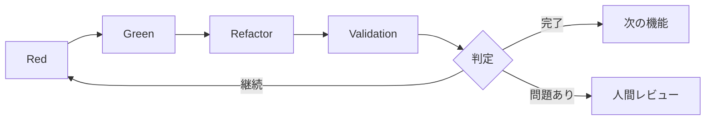

# 3.5 Validationステップの詳細

## Validationステップの位置づけ

ValidationステップはAITDDにおける最も重要な革新の一つです。従来のTDDのRed-Green-Refactorサイクルに追加されたこのステップにより、AI生成コードの品質保証と完了判定を自動化し、より確実な開発プロセスを実現します。

## Validationステップの目的

### 1. 品質保証の多層化
- **機能要件の充足**: 計画された機能が正しく実装されている
- **回帰防止**: 既存機能への悪影響がない
- **コード品質**: 保守可能で高品質なコードが生成されている

### 2. 完了判定の自動化
- 客観的な基準による完了判定
- 人間のレビュー前の事前フィルタリング
- 継続的な品質監視

### 3. プロセス改善のフィードバック
- AI生成コードの品質傾向の把握
- プロンプト改善のための情報収集
- 開発効率の測定と最適化

## Validationステップの実行タイミング



## 具体的な作業手順

### 1. 既存テストのグリーン状態確認

#### 必須条件
すべての既存テストが成功していることが前提条件です。

```bash
# テスト実行
$ npm test

# 期待する結果
✅ User Authentication › should login with valid credentials
✅ User Authentication › should reject invalid password  
✅ User Registration › should create user with valid data
✅ User Registration › should reject duplicate email
✅ Product Management › should create product
✅ Product Management › should list products

Tests: 6 passed, 6 total
Time: 2.341s
Coverage: 94%
```

#### 失敗時の対応
```markdown
❌ テスト失敗がある場合の対応

1. 失敗原因の特定
   - 新規実装による既存機能への影響
   - テストデータの競合
   - 環境依存の問題

2. 修正の実施
   - 問題のあるコードの修正
   - テストデータの調整
   - 環境設定の見直し

3. 再実行による確認
   - 全テストの再実行
   - 成功確認後にValidation継続
```

### 2. TDDメモファイルと要件定義文書の確認

#### 確認対象ファイル
```markdown
## ドキュメント確認リスト

### 必須ファイル
- docs/implements/{{task_id}}/{feature_name}-requirements.md
- docs/implements/{{task_id}}/{feature_name}-testcases.md  
- docs/todo.md

### オプションファイル（存在する場合）
- docs/implements/{{task_id}}/{test_case_name}-memo.md
- docs/implements/{{task_id}}/{feature_name}-architecture.md
```

#### 確認内容例
```markdown
# ユーザー登録機能 要件確認

## requirements.md からの抽出
### 予定機能
- [x] email/password による新規ユーザー登録
- [x] 重複email の検証  
- [x] パスワード強度チェック
- [x] パスワードハッシュ化（bcrypt）
- [ ] レート制限（100件/秒） ← 未実装

### testcases.md からの抽出  
### 予定テストケース数：10件
- TC001: 正常なユーザー登録
- TC002: メールアドレス重複エラー
- TC003: パスワード不一致エラー
- TC004: 無効なメールアドレス形式
- TC005: パスワード強度不足
- TC006: 必須項目未入力
- TC007: 境界値テスト - メールアドレス長
- TC008: レート制限テスト
- TC009: データベース接続エラー
- TC010: CSRFトークン検証
```

### 3. 実装済みテストケースの確認

#### テストファイルの分析
```javascript
// __tests__/user-registration.test.js の分析例

describe('User Registration', () => {
  // 実装済みテストケースの確認
  test('TC001: should create user with valid data', async () => {
    // 実装済み ✅
  });
  
  test('TC002: should reject duplicate email', async () => {
    // 実装済み ✅
  });
  
  test('TC003: should reject password mismatch', async () => {
    // 実装済み ✅
  });
  
  test('TC004: should validate email format', async () => {
    // 実装済み ✅
  });
  
  test('TC005: should validate password strength', async () => {
    // 実装済み ✅
  });
  
  test('TC006: should require all fields', async () => {
    // 実装済み ✅
  });
  
  test('TC007: should handle email length limits', async () => {
    // 実装済み ✅
  });
  
  test('TC010: should verify CSRF token', async () => {
    // 実装済み ✅
  });
  
  // TC008, TC009 は未実装
});
```

#### 実装状況の集計
```markdown
## テストケース実装状況

### 実装済み：8件
- TC001: 正常なユーザー登録 ✅
- TC002: メールアドレス重複エラー ✅
- TC003: パスワード不一致エラー ✅
- TC004: 無効なメールアドレス形式 ✅
- TC005: パスワード強度不足 ✅
- TC006: 必須項目未入力 ✅
- TC007: 境界値テスト ✅
- TC010: CSRFトークン検証 ✅

### 未実装：2件
- TC008: レート制限テスト ❌
- TC009: データベース接続エラー ❌

### 実装率：80% (8/10)
```

### 4. 実装状況の分析とTODO.md更新判定

#### AI による品質リスク評価

```markdown
## AI分析レポート例

### 実装完了度評価
- 基本機能実装率: 100%
- テストケース実装率: 80% 
- 要件充足率: 90%

### 未実装項目の重要度分析
#### TC008: レート制限テスト
- 重要度: 中（セキュリティ関連）
- 影響範囲: プロダクション環境での悪用リスク
- 実装優先度: 中程度

#### TC009: データベース接続エラー
- 重要度: 高（可用性関連）
- 影響範囲: システム全体の安定性
- 実装優先度: 高

### 品質リスク評価
- セキュリティリスク: 中（レート制限未実装）
- 可用性リスク: 高（DB障害時の挙動不明）
- 保守性リスク: 低（コード品質良好）

### 推奨アクション
1. TC009（DB接続エラー）の優先実装
2. TC008（レート制限）の次期実装検討
3. 現状での次ステップ進行は可能だが注意要
```

## Validationの判定基準

### ✅ 完全実装済み（自動で次ステップ）

```markdown
### 完了条件
- 既存テスト状態: すべてグリーン ✅
- テストケース実装率: 100% ✅
- 重要機能完成率: 100% ✅
- 品質リスク: なし ✅
- セキュリティチェック: 合格 ✅

### 自動判定結果
🎉 実装完了 - 次の要件定義ステップに自動進行
```

### ⚠️ 実装不足あり（追加実装必要）

```markdown
### 継続条件（例1: 重大な未実装あり）
- 既存テスト状態: すべてグリーン ✅
- テストケース実装率: 70% ❌
- 重要機能完成率: 80% ❌
- 品質リスク: 高リスク項目あり ❌

### 判定結果
⚠️ 追加実装が必要 - Redステップに戻って未実装項目を追加

### 継続条件（例2: 既存テスト失敗）
- 既存テスト状態: 失敗あり ❌
- テストケース実装率: 90% ✅
- 重要機能完成率: 95% ✅

### 判定結果  
❌ 回帰テスト失敗 - Green/Refactorステップに戻って修正
```

### 🔍 要判断（人間レビュー必要）

```markdown
### 判断が困難なケース
- テストケース実装率: 85%（境界値）
- 未実装項目: 重要度の判断が困難
- 品質リスク: 組織固有の判断が必要
- ビジネス要件: 仕様の解釈に曖昧さ

### 判定結果
🔍 人間レビュー要請 - 専門知識による判断が必要
```

## AIによる判定プロセス

### 1. 情報収集と分析

#### 入力情報
```markdown
## Validation実行時の入力データ

### 技術情報
- テスト実行結果（成功/失敗の詳細）
- コードカバレッジレポート
- 静的解析結果（ESLint、TypeScript等）
- パフォーマンステスト結果

### 仕様情報  
- requirements.md（機能要件・非機能要件）
- testcases.md（テストケース一覧）
- architecture.md（アーキテクチャ設計）

### プロジェクト情報
- 既存コードベース
- 依存関係情報
- 環境設定
```

#### 分析手法
```markdown
## AI分析のアプローチ

### 1. 定量的分析
- テストケース実装率の計算
- コードカバレッジの評価
- 複雑度メトリクスの測定
- パフォーマンス指標の確認

### 2. 定性的分析  
- 要件と実装の整合性確認
- コード品質の主観的評価
- セキュリティ要件のチェック
- 保守性の評価

### 3. リスク評価
- 未実装機能の影響度分析
- セキュリティリスクの評価
- 運用リスクの評価
- 技術負債の評価
```

### 2. 判定ロジック

#### 階層的判定システム
```markdown
## 判定の優先順位

### Level 1: 致命的問題（即座に継続判定）
1. 既存テストの失敗
2. セキュリティ重大問題
3. データ破損リスク

### Level 2: 重要機能の欠如（継続推奨）
1. 基本機能の未実装
2. 重要なエラーハンドリング不足
3. 必須のバリデーション欠如

### Level 3: 品質基準（閾値による判定）
1. テストカバレッジ < 80%
2. テストケース実装率 < 90%
3. 複雑度 > 許容値

### Level 4: 総合判定（完了/継続/要判断）
- 上記すべてを総合した最終判定
- 組織の品質基準との照合
- プロジェクトの状況考慮
```

#### 判定プロンプトの例
```markdown
## Validation判定プロンプト

あなたはAITDD Validationステップの品質判定AIです。以下の情報を基に実装完了判定を行ってください。

### 判定対象
- 機能: ユーザー登録API
- 実装結果: [コード、テスト結果、品質メトリクス]
- 要件: [requirements.md の内容]
- テストケース: [testcases.md の内容]

### 判定基準
1. 既存テスト: 全て成功必須
2. テストケース実装率: 90%以上で完了
3. 重要機能: 100%実装必須
4. セキュリティ: 重大問題なし必須

### 出力形式
```json
{
  "判定結果": "完了|継続|要判断",
  "実装率": {
    "テストケース": "80%",
    "重要機能": "100%"
  },
  "品質評価": {
    "セキュリティ": "合格|注意|不合格",
    "パフォーマンス": "良好|普通|要改善",
    "保守性": "高|中|低"
  },
  "未実装項目": [
    {
      "項目": "TC008",
      "重要度": "中|高|低", 
      "推奨アクション": "即時実装|次期実装|実装不要"
    }
  ],
  "継続理由": "判定が継続の場合の理由",
  "次のアクション": "具体的な次のステップ"
}
```
```

## 信号機システムによる推測可視化

### 信号機システムの活用

ValidationステップではAIの推測部分を可視化し、人間のレビュー効率を向上させます。

#### 🟢 青信号（高確信度）
```markdown
## 元ファイルから明確に推測できる内容

### 例：テストケース実装状況
- 🟢 TC001実装済み（testファイルに該当テストあり）
- 🟢 基本機能動作確認済み（テスト成功結果あり）
- 🟢 エラーハンドリング実装済み（要件書に明記済み）
```

#### 🟡 黄信号（注意・要確認）
```markdown  
## 推測による補完だが妥当と思われる内容

### 例：品質判定
- 🟡 コードカバレッジ80%は十分（一般的基準による判断）
- 🟡 パフォーマンス要件未測定だが問題なし（実装内容から推測）
- 🟡 セキュリティリスク中程度（レート制限未実装による推定）
```

#### 🔴 赤信号（要検証）
```markdown
## 元ファイルになく独自判断による内容

### 例：ビジネス判断
- 🔴 レート制限の実装優先度「中」（組織方針不明）
- 🔴 DB接続エラーハンドリング必須（運用要件未確認）
- 🔴 次期実装で十分（プロジェクトスケジュール不明）
```

### TODO形式による管理

```markdown
## Validation結果TODO

### 🟢 高確信度項目（確認推奨）
- [ ] [testcases.md](./testcases.md) のTC001-007実装完了を確認
- [ ] [要件書](./requirements.md) の基本機能100%実装を確認

### 🟡 中確信度項目（要確認）
- [ ] [実装コード](./src/users.js) のパフォーマンス特性を確認
- [ ] [セキュリティ要件](./requirements.md) の適合性を確認

### 🔴 要判断項目（重要）
- [ ] 詳細確認: [未実装項目](./testcases.md) の実装優先度を組織基準で判定
- [ ] 詳細確認: [運用要件](./requirements.md) のDB障害時要件を確認
- [ ] 詳細確認: プロジェクトスケジュールに基づく実装計画の調整
```

## Validationステップの最適化

### 1. プロンプト改善による精度向上

#### 改善ポイント
```markdown
## プロンプト品質向上のポイント

### 1. 判定基準の明確化
- 数値基準の具体化（カバレッジ80%以上等）
- 優先度判定ルールの詳細化
- 組織固有基準の反映

### 2. コンテキスト情報の充実
- プロジェクト背景の提供
- 既存システムとの関係性
- 運用環境の制約事項

### 3. 出力形式の標準化
- JSON形式での構造化出力
- 信号機システムの活用
- TODO形式での課題整理
```

#### プロンプトテンプレートの進化
```markdown
## 段階的プロンプト改善

### v1.0: 基本版
- 基本的な判定機能
- 単純な完了/継続判定

### v2.0: 詳細化版
- 品質メトリクス評価追加
- リスク評価機能強化
- 信号機システム導入

### v3.0: 組織最適化版  
- 組織固有基準の組み込み
- プロジェクト特性の考慮
- 学習データによる改善
```

### 2. 自動化範囲の拡大

#### 現在の自動化レベル
```markdown
## 自動化の現状

### 完全自動化済み
- テスト実行と結果収集
- 基本的な品質メトリクス測定
- 定型的な判定（明確な基準あり）

### 半自動化（人間確認要）
- 重要度の判定（ビジネス観点）
- セキュリティリスク評価
- アーキテクチャ影響の評価

### 手動対応必須
- 組織方針との整合性確認
- プロジェクト固有事情の考慮
- ステークホルダー調整
```

#### 自動化拡大の方向性
```markdown
## 将来の自動化計画

### 短期（1-3ヶ月）
- 品質基準のカスタマイズ機能
- 過去実績に基づく学習機能
- レポート自動生成機能

### 中期（3-6ヶ月）
- 組織固有ルールの学習
- プロジェクト特性の自動考慮
- ステークホルダー通知自動化

### 長期（6ヶ月以上）
- 予測的品質管理
- 自動的なプロセス最適化
- チーム学習の組み込み
```

## よくある問題と解決策

### 問題1: 判定基準が曖昧

**症状**: 
- 完了/継続の判定が一貫しない
- 人間とAIの判定に乖離がある

**原因**:
- 組織固有の品質基準が未定義
- 判定ルールの曖昧さ

**解決策**:
```markdown
### 判定基準の明確化
1. 数値基準の設定
   - テストカバレッジ: 80%以上
   - テストケース実装率: 90%以上
   - 重要機能完成率: 100%

2. 品質基準の文書化
   - セキュリティ要件チェックリスト
   - パフォーマンス許容値
   - コード品質基準

3. 例外処理ルールの定義
   - プロジェクト固有の事情考慮
   - 緊急リリース時の基準緩和
   - 技術負債の許容レベル
```

### 問題2: 人間レビューのボトルネック

**症状**:
- Validationで要判断が頻発
- 人間レビューの待ち時間増加

**原因**:
- AI判定の精度不足
- 組織ルールの学習不足

**解決策**:
```markdown
### AI判定精度の向上
1. 学習データの蓄積
   - 過去の判定結果をフィードバック
   - 成功/失敗パターンの学習
   - 組織固有ルールの反映

2. プロンプト改善
   - より具体的な判定基準
   - コンテキスト情報の充実
   - 段階的判定システム

3. 閾値の調整
   - 自動完了の基準厳格化
   - 要判断の基準明確化
   - 継続判定の精度向上
```

### 問題3: 過度な品質要求

**症状**:
- 完了判定されない項目が多い
- 開発効率の低下

**原因**:
- 品質基準が厳しすぎる
- 完璧主義的な設定

**解決策**:
```markdown
### バランスの取れた品質管理
1. 段階的品質基準
   - MVP（最小実装）基準
   - プロダクション基準
   - エンタープライズ基準

2. リスクベース判定
   - 影響度に応じた基準調整
   - 重要機能の優先実装
   - 非重要機能の後回し許可

3. 継続的改善
   - 定期的な基準見直し
   - チームフィードバックの反映
   - 実績に基づく最適化
```

## まとめと次のステップ

Validationステップは、AITDDプロセスの品質保証の要であり、適切に運用することで：

### 得られる効果
- **品質の安定化**: 一貫した品質基準の適用
- **効率の向上**: 人間レビューの最適化
- **継続的改善**: プロセス改善のフィードバック循環

### 成功のポイント
- **明確な基準設定**: 数値化された判定基準
- **段階的導入**: 組織に合わせた段階的適用
- **継続的最適化**: 実績に基づくプロセス改善

### 次の学習
第3章でAITDDプロセスの全体像を理解した後は、[第4章 実践ハンズオン](../04-hands-on/01-first-project.md)で実際にAITDDを体験してみましょう。

実際の開発を通じて、このValidationステップがどのように機能し、品質向上に寄与するかを体感できます。
