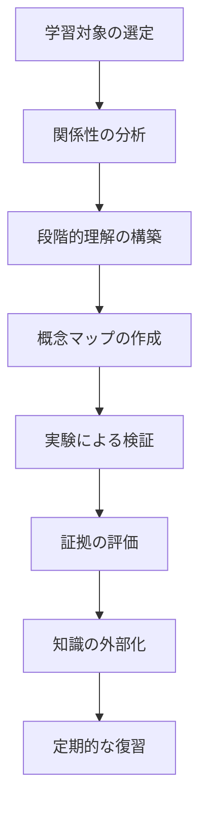

# 9.1 学習支援フレームワークの概要

## 学習支援フレームワークとは

Tsumikiの学習支援フレームワークは、プログラミング以外の一般的な学習（勉強）を体系的にサポートする機能群です。AIの力を活用して、概念理解から実践的な検証まで、効果的な学習プロセスを実現します。

## 学習プロセスの全体像



### 基本的な学習フロー

```
関係分析 → ズーム要約 → 概念マップ → 最小実験 → 証拠評価 → 外部化 → 復習
```

## 7つの学習テクニック

### 1. 関係の型を明示（learn-relation-type）

**目的**: 概念間の関係を分類し、理解の精度を高める

**特徴**:
- 粒度差、包含、時系列など7つの関係タイプで分類
- 初心者の誤解を事前に防止
- 実務への影響を具体的に提示

### 2. ズーム段階の要約（learn-zoom-summary）

**目的**: 同じトピックを異なる詳細度で把握

**特徴**:
- 30秒・3分・30分の3段階で理解を構築
- 段階的な学習を可能に
- 「分かったつもり」を防止

### 3. 概念マップ作成（learn-concept-map）

**目的**: 学習領域の全体構造を可視化

**特徴**:
- 10-12ノードで概念間の関係を整理
- is-a、part-of、因果などの関係線を明示
- 学習ルートの提案

### 4. 最小実験に落とす（learn-minimal-experiment）

**目的**: 抽象的な概念を具体的な体験に変換

**特徴**:
- 15分以内で実施可能な実験を設計
- 定量的・定性的な観測指標
- 安全性と再現性を重視

### 5. 根拠の取り扱い（learn-evidence-classification）

**目的**: 情報の信頼性を評価し、ハルシネーションを防止

**特徴**:
- A級（一次文献）からD級（仮説）まで4段階で分類
- 検証方法と検索クエリを提供
- 対立する証拠も公平に提示

### 6. 学習の外部化（learn-externalization）

**目的**: 記憶の定着と継続的な復習を支援

**特徴**:
- クイズ、カード、穴埋め問題を自動生成
- 間違いノートで誤解を修正
- 科学的な復習スケジュール

### 7. 統合オーケストレーション（learn-orchestration）

**目的**: すべての学習テクニックを統合した体系的セッション

**特徴**:
- 6つのテクニックを順次実行
- 学習メトリクスの追跡
- フィードバックループの構築

## 学習支援の特徴

### AIとの協調学習

- **AIの役割**: 情報の構造化、関係性の分析、問題生成
- **人間の役割**: 理解の確認、実験の実施、知識の応用
- **相乗効果**: AIの処理能力と人間の創造性を組み合わせ

### 科学的アプローチ

- **実験重視**: 仮説→検証→フィードバックのサイクル
- **証拠ベース**: 情報源の信頼性を常に評価
- **メタ認知**: 自分の理解度を客観的に把握

### 実践的な設計

- **時間制約への対応**: 15分、30分などの短時間セッション
- **環境への適応**: 家庭、オフィス、移動中でも実施可能
- **コスト最小化**: 0円または低コストで実施可能

## 期待される効果

### 短期的効果

- 概念の明確な理解
- 誤解の早期発見と修正
- 学習効率の向上

### 長期的効果

- 体系的な知識の構築
- 批判的思考力の向上
- 自己学習能力の強化

## 対象となる学習分野

### 特に効果的な分野

- **技術学習**: プログラミング言語、フレームワーク、ツール
- **理論学習**: 数学、物理、化学などの理系科目
- **言語学習**: 文法、語彙、表現パターン
- **実技学習**: 料理、写真、音楽などの技能

### 応用可能な分野

- ビジネススキル
- 資格試験対策
- 趣味の深掘り
- 研究・論文執筆

## 注意事項

### 安全性の確保

- 実験では常に安全を最優先
- 不確実な場合は専門家に相談
- 物理的・健康的リスクの事前評価

### 情報の信頼性

- ハルシネーションに注意
- 複数の情報源で検証
- 批判的に情報を評価

### 学習ペースの調整

- 無理のないペースを維持
- 定期的な休憩の確保
- 個人の学習スタイルに合わせた調整