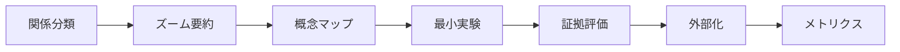

# 9.3 各学習コマンドの詳細解説

## learn-relation-type - 関係の型を明示させる

### 概要
概念間の関係を7つのタイプに分類し、理解の精度を高めるコマンドです。

### 関係タイプの種類

| タイプ | 説明 | 例 |
|--------|------|-----|
| **粒度差** | 抽象度の違い | クラス ↔ インスタンス |
| **包含** | 全体と部分 | 自動車 ↔ エンジン |
| **時系列** | 前後関係 | 設計 → 実装 |
| **用途** | 目的と手段 | 問題 ↔ 解決策 |
| **前提⇄派生** | 依存関係 | 基礎理論 → 応用技術 |
| **正交** | 独立した軸 | 性能 ⊥ 保守性 |
| **不明** | 分類困難 | - |

### 使用例

```bash
/learn-relation-type HTTP HTTPS SSL/TLS
```

**出力例**:
```markdown
## 概念：HTTP と HTTPS の関係

### 関係タイプ
- **分類**: 前提⇄派生
- **根拠**: HTTPSはHTTPにセキュリティ層を追加した派生プロトコル
- **確信度**: 95%

### 見分け方（観測可能なテスト）
1. URLスキームの違い（http:// vs https://）
2. ポート番号の違い（80 vs 443）
3. 証明書の有無

### 初心者の誤解
1. **誤解**: HTTPSは全く別のプロトコル
   **正解**: HTTPSはHTTP + SSL/TLS
```

### 活用シーン
- 新しい技術を学ぶ際の概念整理
- 類似概念の違いを明確化
- チーム内での認識統一

---

## learn-zoom-summary - ズーム段階の要約

### 概要
同じトピックを30秒・3分・30分の3段階で説明し、段階的な理解を構築します。

### 各レベルの特徴

| レベル | 時間 | 内容量 | 用途 |
|--------|------|--------|------|
| **30秒版** | エレベーターピッチ | 3つの要点 | 概要把握 |
| **3分版** | 概要説明 | 5-7個の概念 | 基本理解 |
| **30分版** | 詳細解説 | 体系的説明 | 完全理解 |

### 使用例

```bash
/learn-zoom-summary ブロックチェーン 初心者 比喩OK
```

**出力例（30秒版）**:
```markdown
## 30秒で理解する

### 一言で言うと
改ざん不可能な分散型デジタル台帳技術

### 3つの要点
1. 取引記録をブロックにまとめて連鎖
2. 複数のコンピュータで同じ記録を保持
3. 暗号技術により改ざんを防止

### 身近な例
みんなで管理する絶対に書き換えられない共有家計簿
```

### 活用シーン
- プレゼンテーション準備
- 知識レベルに応じた説明
- 学習の段階的深化

---

## learn-concept-map - 概念マップ作成

### 概要
10-12個のノードで構成される概念マップを作成し、学習領域の全体構造を可視化します。

### エッジ（関係線）の種類

| 種類 | 意味 | 記号 |
|------|------|------|
| **is-a** | 継承関係 | → |
| **part-of** | 構成関係 | ⊂ |
| **関連** | 相関関係 | ⟷ |
| **因果** | 原因結果 | ⇒ |
| **前提** | 依存関係 | ← |

### 使用例

```bash
/learn-concept-map オブジェクト指向プログラミング 10 中級
```

**出力例**:
```markdown
## 中核ノード（10個）

        オブジェクト指向
       /      |      \
    クラス  継承  ポリモーフィズム
      |       |         |
インスタンス 親子関係  インターフェース
      |       |         |
    属性   オーバーライド  実装

## 重要な関係線
- クラス →(is-a)→ 設計図
- インスタンス →(part-of)→ クラス
- 継承 ⇒(因果)⇒ コードの再利用
```

### 活用シーン
- 学習計画の立案
- 知識の体系化
- 概念間の関係理解

---

## learn-minimal-experiment - 最小実験に落とす

### 概要
抽象的な概念を15分以内で実施可能な具体的実験に変換します。

### 実験の構成要素

| 要素 | 内容 | 重要度 |
|------|------|--------|
| **仮説** | 検証したい予測 | 必須 |
| **手順** | 5ステップ以内 | 必須 |
| **観測指標** | 定量的/定性的 | 必須 |
| **安全対策** | リスクと対処 | 必須 |
| **交絡要因** | 影響する要因 | 推奨 |

### 使用例

```bash
/learn-minimal-experiment キャッシュの効果 15分 ブラウザ
```

**出力例**:
```markdown
## 実験1：ブラウザキャッシュの効果測定

### 仮説
キャッシュ有効時は2回目以降のページ読み込みが50%以上高速化する

### 手順
1. デベロッパーツールでNetwork タブを開く
2. キャッシュをクリアして測定サイトにアクセス
3. 読み込み時間を記録
4. 同じページを再読み込み
5. 2回目の読み込み時間を比較

### 観測指標
- **定量**: 読み込み時間（ms）、転送サイズ（KB）
- **定性**: 体感速度の違い
```

### 活用シーン
- 理論の実践的検証
- 仮説の妥当性確認
- 体験を通じた理解

---

## learn-evidence-classification - 根拠の取り扱い

### 概要
情報をA級からD級まで4段階の信頼性レベルで分類します。

### 証拠レベルの分類

| レベル | 種類 | 信頼度 | 例 |
|--------|------|--------|-----|
| **A級** | 一次文献 | 最高 | 査読済み論文、公式仕様書 |
| **B級** | 標準・権威 | 高 | 教科書、公的文書 |
| **C級** | 専門家合意 | 中 | 実務慣習、通説 |
| **D級** | 仮説・経験 | 低 | 個人的見解、推測 |

### 使用例

```bash
/learn-evidence-classification プログラミング言語の学習順序 詳細 3
```

**出力例**:
```markdown
### 主張1：Pythonから始めるべき

#### 証拠分類：C級

#### 検証計画
- **根拠の出所**: プログラミング教育コミュニティの共通認識
- **検証方法**:
  1. 大学のCS入門コースのシラバス調査
  2. 初心者の学習成果の追跡調査
- **検索クエリ**:
  - Google Scholar: "first programming language empirical study"

#### 信頼性評価
- **確信度**: 70%
- **バイアスリスク**: 英語圏の傾向に偏重
```

### 活用シーン
- 情報の信頼性評価
- 研究・調査活動
- 意思決定の根拠確認

---

## learn-externalization - 学習の外部化

### 概要
学習内容をクイズ、カード、穴埋め問題などの形式で外部化し、記憶定着を支援します。

### 生成される成果物

| 種類 | 内容 | 用途 |
|------|------|------|
| **要約** | 要点5個、誤解2個 | 振り返り |
| **回想クイズ** | 基本理解の確認 | 復習 |
| **応用クイズ** | 深い理解の確認 | 応用力 |
| **穴埋め** | 用語の定着 | 暗記 |
| **用語カード** | 1カード1概念 | 反復学習 |
| **間違いノート** | 誤解の修正 | 弱点克服 |

### 使用例

```bash
/learn-externalization 今日のReact学習 全部 中級
```

**出力例**:
```markdown
## 回想クイズ

### Q1. [難易度：★★☆]
**問題**: useEffectフックの第2引数の役割は？
<details>
<summary>答えを見る</summary>
**答え**: 依存配列。指定した値が変更された時のみ副作用を実行
**解説**: 空配列[]ならマウント時のみ、省略なら毎回実行
</details>

## 用語カード

### カード1：useState
- **定義**: 関数コンポーネントで状態を管理するReact Hook
- **例**: const [count, setCount] = useState(0)
- **使用文脈**: コンポーネントの内部状態管理
- **復習予定**: 3日後
```

### 活用シーン
- 日々の学習まとめ
- 試験対策
- 知識の長期定着

---

## learn-orchestration - 統合オーケストレーション

### 概要
6つの学習テクニックをすべて統合し、体系的な学習セッションを実行します。

### セッションの流れ



### 使用例

```bash
/learn-orchestration 機械学習の基礎 2時間 自宅 理論と実践の理解
```

**出力内容**:
1. 主要概念の関係性分析
2. 30秒/3分/30分の段階的要約
3. 10ノードの概念マップ
4. 2つの検証実験
5. 主張の証拠レベル評価
6. 復習用クイズとカード
7. 学習メトリクスとフィードバック

### 活用シーン
- 新分野の体系的学習
- 複雑なトピックの完全理解
- 学習効果の最大化

## コマンドの組み合わせ例

### 初学者向けパターン
```bash
1. /learn-zoom-summary [トピック] 初心者 30秒のみ
2. /learn-relation-type [主要概念2-3個]
3. /learn-externalization [学習内容] クイズのみ 初級
```

### 実践重視パターン
```bash
1. /learn-minimal-experiment [技術] 15分 利用可能な環境
2. /learn-evidence-classification [実験結果の妥当性]
3. /learn-externalization [実験の学び] カードのみ
```

### 研究者向けパターン
```bash
1. /learn-concept-map [研究分野] 12 上級
2. /learn-evidence-classification [主要な主張] 詳細 10
3. /learn-relation-type [競合理論や手法]
```