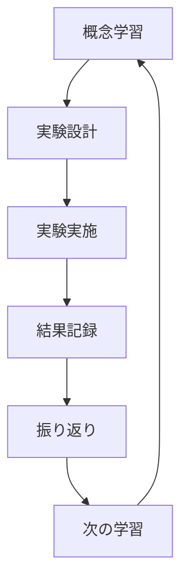

# 9.4 学習フレームワークのベストプラクティス

## 効果的な学習戦略

### 1. スパイラル学習法

同じトピックを異なる深度で繰り返し学習することで、理解を深化させます。

```
初回: 30秒要約 → 関係分類 → 外部化（初級）
2回目: 3分要約 → 概念マップ → 最小実験 → 外部化（中級）
3回目: 30分要約 → 証拠評価 → 応用実験 → 外部化（上級）
```

**実例: Dockerの学習**
```bash
# Day 1 - 概要理解
/learn-zoom-summary Docker 初心者 30秒のみ
/learn-relation-type コンテナ 仮想マシン Docker

# Day 3 - 構造理解
/learn-concept-map Docker技術スタック 10 中級
/learn-minimal-experiment Dockerコンテナ作成 20分

# Day 7 - 深い理解
/learn-orchestration Docker 2時間 実環境 本番運用レベル
```

### 2. フィードバックループの構築

学習→実験→振り返り→改善のサイクルを高速で回します。



**テンプレート**:
```bash
# 1. 仮説を立てる
/learn-minimal-experiment [概念] 制約条件

# 2. 実験を実施（手動）
# 3. 結果を記録

# 4. 振り返りと外部化
/learn-externalization 実験結果：[観察内容]

# 5. 次の実験を設計
/learn-minimal-experiment [改善版の実験]
```

### 3. 証拠ベース学習

情報の信頼性を常に評価し、確かな知識を構築します。

**信頼性ピラミッド**:
```
      A級
    (実験・論文)
   /          \
  B級        B級
(教科書)    (公式文書)
 /              \
C級            C級
(実務慣習)  (専門家意見)
/                  \
D級              D級
(ブログ)        (経験談)
```

**実践方法**:
```bash
# 情報収集時は必ず証拠レベルを確認
/learn-evidence-classification [学習トピック] 詳細

# A級・B級の情報を優先的に学習
# C級・D級は実験で検証
```

## 学習パターン別の推奨フロー

### パターン1: 理論重視型

**対象**: 数学、物理、アルゴリズムなど

```bash
1. /learn-concept-map [理論名] 12 上級
2. /learn-relation-type [主要定理・法則]
3. /learn-evidence-classification [理論の根拠] 詳細
4. /learn-zoom-summary [理論] 上級 数式OK
5. /learn-externalization [理論の要点] 全部 上級
```

### パターン2: 実践重視型

**対象**: プログラミング、料理、工作など

```bash
1. /learn-minimal-experiment [技術] 15分 環境
2. /learn-zoom-summary [技術] 中級 3分版
3. /learn-relation-type [使用する概念]
4. /learn-minimal-experiment [応用実験] 30分
5. /learn-externalization [実践の学び] カード
```

### パターン3: 暗記重視型

**対象**: 語学、資格試験、用語学習など

```bash
1. /learn-zoom-summary [範囲] 初級 全レベル
2. /learn-concept-map [試験範囲] 15
3. /learn-externalization [学習内容] 全部 段階別
4. # 毎日: クイズとカードで復習
5. /learn-externalization [弱点] クイズのみ 高難度
```

### パターン4: 研究・調査型

**対象**: 論文執筆、市場調査、技術選定など

```bash
1. /learn-concept-map [研究領域] 12 上級
2. /learn-evidence-classification [主要主張] 詳細 10
3. /learn-relation-type [競合する理論・手法]
4. /learn-orchestration [研究テーマ] 制限なし 研究環境
```

## よくある失敗と対策

### 失敗1: 情報過多による混乱

**症状**: 大量の情報に圧倒され、何も覚えられない

**対策**:
```bash
# 30秒要約から始める
/learn-zoom-summary [トピック] 初心者 30秒のみ

# 核心を3つに絞る
/learn-relation-type [概念1] [概念2] [概念3]

# 最小実験1つだけ実施
/learn-minimal-experiment [1つの概念] 10分
```

### 失敗2: 実践なき理論学習

**症状**: 概念は理解したが、実際に使えない

**対策**:
```bash
# 必ず実験を組み込む
/learn-minimal-experiment [学んだ概念] 15分

# 実験結果を振り返る
/learn-externalization 実験で学んだこと：[内容]

# 応用実験を設計
/learn-minimal-experiment [応用シナリオ] 30分
```

### 失敗3: 復習の欠如

**症状**: 学んだことをすぐ忘れる

**対策**:
```bash
# 毎日の学習を外部化
/learn-externalization 今日の学習 全部

# 復習スケジュールに従う
- 1日後: 回想クイズ
- 3日後: 応用クイズ
- 1週間後: 用語カード
- 1ヶ月後: 全体復習
```

### 失敗4: 批判的思考の欠如

**症状**: 間違った情報を鵜呑みにする

**対策**:
```bash
# 必ず証拠レベルを確認
/learn-evidence-classification [情報] 詳細

# 対立する見解を調査
/learn-relation-type [理論A] [理論B] 対立点

# 実験で検証
/learn-minimal-experiment [検証したい主張]
```

## 学習効果を高めるTips

### 1. メタ認知の活用

自分の理解度を客観的に把握します。

```markdown
## 理解度チェックリスト
- [ ] 30秒で説明できる
- [ ] 他人に教えられる
- [ ] 具体例を3つ挙げられる
- [ ] 関連概念との違いを説明できる
- [ ] 実践で応用できる
```

### 2. 学習ログの記録

```markdown
## 学習ログテンプレート
日付: YYYY-MM-DD
トピック: [学習内容]
使用コマンド: [実行したコマンド]
学習時間: [分]
理解度: [1-10]
疑問点: [未解決の疑問]
次回: [次に学ぶこと]
```

### 3. 学習コミュニティの活用

- 生成したクイズを他者と共有
- 概念マップを比較検討
- 実験結果を報告し合う
- 証拠レベルの評価を議論

### 4. 定期的な棚卸し

```bash
# 月次レビュー
/learn-orchestration [今月学んだこと] 総復習モード

# 弱点の特定と強化
/learn-externalization [苦手分野] クイズのみ 高難度

# 次月の計画
/learn-concept-map [来月の学習計画] 15
```

## 環境別の最適化

### 通勤・移動中

```bash
# 読むだけで学習
/learn-zoom-summary [トピック] 初級 テキストのみ
/learn-externalization [昨日の学習] クイズのみ
```

### 自宅学習

```bash
# じっくり実験
/learn-minimal-experiment [技術] 30分 フル環境
/learn-orchestration [テーマ] 2時間 自宅 完全理解
```

### オフィス・職場

```bash
# 短時間で効率的に
/learn-relation-type [業務関連概念]
/learn-evidence-classification [技術選定] 簡易
```

## 長期的な学習計画

### 3ヶ月計画の例

**月1: 基礎構築**
- Week 1-2: 概念理解と関係整理
- Week 3-4: 最小実験と基礎固め

**月2: 実践応用**
- Week 5-6: 応用実験と問題解決
- Week 7-8: 弱点克服と知識統合

**月3: 定着発展**
- Week 9-10: プロジェクト適用
- Week 11-12: 知識体系の完成

### 成果の可視化

```markdown
## 学習成果ダッシュボード
- 学習したトピック数: X個
- 実施した実験数: Y回
- 生成したカード数: Z枚
- クイズ正答率: N%
- A級証拠の収集数: M件
```