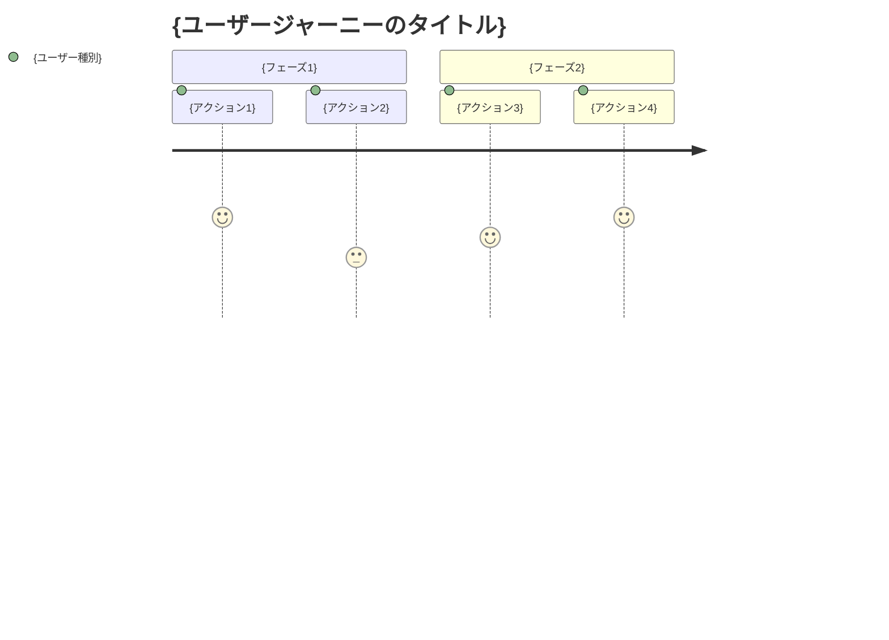

# kairo-requirements

## 目的

ユーザから提供された要件の概要を分析し、EARS（Easy Approach to Requirements Syntax）記法を使用して詳細な受け入れ基準を含む要件定義書を作成する。

## 前提条件

- ユーザから要件の概要が提供されている
- `docs/spec/` ディレクトリが存在する（なければ作成）

## 実行内容

**【信頼性レベル指示】**:
各項目について、元の資料（EARS要件定義書・設計文書含む）との照合状況を以下の信号でコメントしてください：

- 🟢 **青信号**: EARS要件定義書・設計文書を参考にしてほぼ推測していない場合
- 🟡 **黄信号**: EARS要件定義書・設計文書から妥当な推測の場合
- 🔴 **赤信号**: EARS要件定義書・設計文書にない推測の場合

1. **要件の分析**
   - ユーザから提供された要件の概要を理解する
   - @agent-symbol-searcher で関連する既存要件・設計文書を検索し、見つかったファイルをReadツールで読み込み
   - 関連するドメイン知識を適用する
   - 不明確な点がある場合は、一般的なベストプラクティスに基づいて補完する

2. **ユーザストーリーの作成**
   - WHO（誰が）、WHAT（何を）、WHY（なぜ）の形式で記述
   - 各機能の価値を明確にする

3. **EARS記法による要件定義**
   - **通常要件（SHALL）**: システムが通常実行すべき動作
   - **条件付き要件（WHEN/IF-THEN）**: 特定の条件下での動作
   - **不要要件（WHERE）**: 特定の状態での動作
   - **オプション要件（MAY）**: 任意の機能
   - **制約要件（MUST）**: システムの制約事項

4. **Edgeケースの定義**
   - 異常系の処理
   - 境界値の処理
   - エラーハンドリング
   - パフォーマンス要件

5. **ファイルの作成**
   - `docs/spec/{要件名}-requirements.md`: 機能要件と関連文書へのリンク
   - `docs/spec/{要件名}-user-stories.md`: 詳細なユーザストーリー
   - `docs/spec/{要件名}-acceptance-criteria.md`: 受け入れ基準とテスト項目
   - マークダウン形式で構造化された文書を作成

## 出力フォーマット例

### 1. requirements.md（メインファイル）

```markdown
# {要件名} 要件定義書

## 概要

{要件の概要}

## 関連文書

- **ユーザストーリー**: [📖 {要件名}-user-stories.md]({要件名}-user-stories.md)
- **受け入れ基準**: [✅ {要件名}-acceptance-criteria.md]({要件名}-acceptance-criteria.md)

## 機能要件（EARS記法）

### 通常要件

- REQ-001: システムは {通常の動作} しなければならない
- REQ-002: システムは {通常の動作} しなければならない

### 条件付き要件

- REQ-101: {条件} の場合、システムは {動作} しなければならない
- REQ-102: {条件} の場合、システムは {動作} しなければならない

### 状態要件

- REQ-201: {状態} にある場合、システムは {動作} しなければならない

### オプション要件

- REQ-301: システムは {オプション機能} してもよい

### 制約要件

- REQ-401: システムは {制約事項} しなければならない

## 非機能要件

### パフォーマンス

- NFR-001: {パフォーマンス要件}

### セキュリティ

- NFR-101: {セキュリティ要件}

### ユーザビリティ

- NFR-201: {ユーザビリティ要件}

## Edgeケース

### エラー処理

- EDGE-001: {エラーケース}

### 境界値

- EDGE-101: {境界値ケース}
```

### 2. user-stories.md（詳細なユーザストーリー）

```markdown
# {要件名} ユーザストーリー

## 概要

このドキュメントは{要件名}機能の詳細なユーザストーリーを記載します。

## ユーザー種別の定義

### プライマリユーザー

- **エンドユーザー**: {エンドユーザーの詳細説明}
- **管理者**: {管理者の詳細説明}
- **開発者**: {開発者の詳細説明}

### セカンダリユーザー

- **システム管理者**: {システム管理者の詳細説明}
- **外部システム**: {外部システムの詳細説明}

## ユーザストーリー

### 📚 エピック1: {大きな機能グループ}

#### ストーリー1.1: {具体的なストーリー名}

**ユーザストーリー**:
- **私は** {ユーザー種別} **として**
- **{具体的な状況・コンテキスト} において**
- **{実現したい行動・操作} をしたい**
- **そうすることで** {得られる価値・解決される問題}

**詳細説明**:
- **背景**: {なぜこの機能が必要なのか}
- **前提条件**: {このストーリーの前提となる状況}
- **利用シーン**: {具体的な利用場面の例}
- **期待する体験**: {ユーザーが期待する体験の詳細}

**関連要件**: REQ-001, REQ-002

**優先度**: 高/中/低

**見積もり**: {ストーリーポイントまたは工数}

#### ストーリー1.2: {具体的なストーリー名}

{同様の形式で記載}

### 📚 エピック2: {大きな機能グループ}

{同様の形式で記載}

## ユーザージャーニー

### ジャーニー1: {代表的な利用フロー}



**詳細**:
1. **{アクション1}**: {詳細な説明}
2. **{アクション2}**: {詳細な説明}

## ペルソナ定義

### ペルソナ1: {代表的ユーザー名}

- **基本情報**: {年齢、職業、技術レベル等}
- **ゴール**: {このユーザーが達成したいこと}
- **課題**: {現在抱えている問題}
- **行動パターン**: {典型的な行動の特徴}
- **利用環境**: {使用するデバイス、環境等}

## 非機能的ユーザー要求

### ユーザビリティ要求

- **学習容易性**: {初回利用時の学習コスト}
- **効率性**: {熟練後の作業効率}
- **記憶しやすさ**: {再利用時の記憶のしやすさ}
- **エラー対応**: {エラー時の対応しやすさ}
- **満足度**: {主観的な満足度}

### アクセシビリティ要求

- **視覚**: {視覚障害者への配慮}
- **聴覚**: {聴覚障害者への配慮}
- **運動**: {運動機能障害者への配慮}
- **認知**: {認知障害者への配慮}
```

### 3. acceptance-criteria.md（受け入れ基準）

```markdown
# {要件名} 受け入れ基準

## 概要

このドキュメントは{要件名}機能の受け入れ基準とテスト項目を記載します。

## 機能テスト基準

### REQ-001: {要件名} の受け入れ基準

**Given（前提条件）**:
- {テスト実行前の状態}
- {必要な初期データ}

**When（実行条件）**:
- {実行するアクション}
- {入力するデータ}

**Then（期待結果）**:
- {期待される出力・状態}
- {確認すべき副作用}

**テストケース**:
- [ ] 正常系: {正常なケースの詳細}
- [ ] 異常系: {異常なケースの詳細}
- [ ] 境界値: {境界値テストの詳細}

### REQ-002: {要件名} の受け入れ基準

{同様の形式で記載}

## 非機能テスト基準

### パフォーマンステスト

**NFR-001: {パフォーマンス要件}**

- [ ] 応答時間: {具体的な時間基準}
- [ ] スループット: {処理量の基準}
- [ ] 同時接続数: {同時利用者数の基準}
- [ ] リソース使用量: {CPU・メモリ使用量の基準}

**テスト方法**:
- 負荷テストツール: {使用するツール}
- テストシナリオ: {具体的なテスト手順}
- 合格基準: {定量的な合格ライン}

### セキュリティテスト

**NFR-101: {セキュリティ要件}**

- [ ] 認証: {認証機能のテスト項目}
- [ ] 認可: {権限制御のテスト項目}
- [ ] データ保護: {データ暗号化のテスト項目}
- [ ] 脆弱性: {セキュリティ脆弱性のテスト項目}

## ユーザビリティテスト基準

### UX/UIテスト

- [ ] 直感的操作性: {操作の分かりやすさ}
- [ ] レスポンシブデザイン: {各デバイスでの表示}
- [ ] アクセシビリティ: {WCAG 2.1準拠}
- [ ] エラーメッセージ: {分かりやすいエラー表示}

**テスト方法**:
- ユーザビリティテスト: {実施方法}
- A/Bテスト: {比較テストの方法}
- アクセシビリティチェック: {使用するツール}

## Edgeケーステスト基準

### EDGE-001: {エラーケース} の受け入れ基準

**テストシナリオ**:
- {異常な状況の設定}
- {期待されるエラーハンドリング}
- {ユーザーへの適切な通知}

**合格基準**:
- [ ] システムがクラッシュしない
- [ ] 適切なエラーメッセージが表示される
- [ ] データの整合性が保たれる
- [ ] 復旧可能な状態を維持する

## 統合テスト基準

### システム間連携テスト

- [ ] 外部API連携: {外部システムとの連携テスト}
- [ ] データベース連携: {DB操作の整合性テスト}
- [ ] ファイルシステム: {ファイル操作のテスト}

## リグレッションテスト基準

### 既存機能影響確認

- [ ] 既存機能の動作確認: {影響範囲の特定と確認}
- [ ] パフォーマンス劣化確認: {既存機能の性能確認}
- [ ] セキュリティ設定確認: {セキュリティ機能の継続確認}

## 受け入れテスト実行チェックリスト

### テスト実行前

- [ ] テスト環境の準備完了
- [ ] テストデータの準備完了
- [ ] テストツールの準備完了
- [ ] 実行担当者の確認完了

### テスト実行中

- [ ] 全機能テストの実行
- [ ] 全非機能テストの実行
- [ ] 問題発見時の記録
- [ ] 修正後の再テスト

### テスト完了後

- [ ] テスト結果の記録
- [ ] 残存問題の整理
- [ ] 受け入れ可否の判定
- [ ] ステークホルダーへの報告
```

## 実行後の確認

- @agent-symbol-searcher で作成した要件との関連性を確認
- 作成した3つのファイルのパスを表示
  - `docs/spec/{要件名}-requirements.md`
  - `docs/spec/{要件名}-user-stories.md` 
  - `docs/spec/{要件名}-acceptance-criteria.md`
- 主要な要件の数とユーザストーリー数を報告
- 各ファイル内のリンクが正しく設定されていることを確認
- ユーザに確認を促すメッセージを表示
