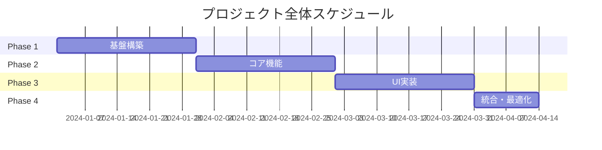

# kairo-tasks

## 目的

設計文書に基づいて実装タスクを1日単位の粒度で分割し、1ヶ月単位のフェーズに整理する。各フェーズ毎に個別のタスクファイルを作成し、依存関係を考慮した適切な順序で管理する。

## 前提条件

- `docs/design/{要件名}/` に設計文書が存在する
- 設計がユーザによって承認されている（または承認が省略されている）
- `docs/tasks/` ディレクトリが存在する（なければ作成）

## 実行内容

**【信頼性レベル指示】**:
各項目について、元の資料（EARS要件定義書・設計文書含む）との照合状況を以下の信号でコメントしてください：

- 🟢 **青信号**: EARS要件定義書・設計文書を参考にしてほぼ推測していない場合
- 🟡 **黄信号**: EARS要件定義書・設計文書から妥当な推測の場合
- 🔴 **赤信号**: EARS要件定義書・設計文書にない推測の場合

1. **設計文書の分析**
   - @agent-symbol-searcher で設計文書を検索し、見つかったファイルをReadツールで読み込み
   - `docs/design/{要件名}/architecture.md` をReadツールで読み込み
   - `docs/design/{要件名}/database-schema.sql` をReadツールで読み込み
   - `docs/design/{要件名}/api-endpoints.md` をReadツールで読み込み
   - `docs/design/{要件名}/interfaces.ts` をReadツールで読み込み
   - `docs/design/{要件名}/dataflow.md` をReadツールで読み込み

2. **既存タスクファイルの確認**
   - @agent-symbol-searcher で既存タスクIDを検索し、見つかったタスクファイルをReadツールで読み込み
   - 既存の`docs/tasks/{要件名}-*.md`ファイルをReadツールで読み込み
   - 使用済みタスク番号（TASK-0001形式）を抽出
   - 新規タスクで重複しない番号を割り当て

3. **タスクの洗い出し**
   - 基盤タスク（DB設定、環境構築など）
   - バックエンドタスク（API実装）
   - フロントエンドタスク（UI実装）
   - 統合タスク（E2Eテストなど）

4. **依存関係の分析**
   - タスク間の依存関係を明確化
   - 並行実行可能なタスクを識別
   - クリティカルパスを特定

5. **タスクの詳細化**
   各タスクに以下を含める：
   - タスクID（TASK-0001形式の4桁番号）
   - タスク名
   - タスクタイプ（TDD/DIRECT）
     - **TDD**: コーディング、ビジネスロジック実装、UI実装、テスト実装など開発作業
     - **DIRECT**: 環境構築、設定ファイル作成、ドキュメント作成、ビルド設定など準備作業
   - 要件へのリンク
   - 依存タスク
   - 実装詳細
   - 単体テスト要件
   - 統合テスト要件
   - UI/UX要件（該当する場合）
     - ローディング状態
     - エラー表示
     - モバイル対応
     - アクセシビリティ要件

6. **タスクの順序付け**
   - 依存関係に基づいて実行順序を決定
   - マイルストーンを設定
   - 並行実行可能なタスクをグループ化

7. **フェーズ分割とファイル作成**
   - タスクを1ヶ月程度の期間でフェーズに分割
   - 各フェーズ毎に個別のタスクファイルを作成
   - `docs/tasks/{要件名}-overview.md`: 全体概要とフェーズ一覧
   - `docs/tasks/{要件名}-phase1.md`: フェーズ1の詳細タスク
   - `docs/tasks/{要件名}-phase2.md`: フェーズ2の詳細タスク
   - （以下、フェーズ数に応じて継続）
   - 各タスクを1日単位の粒度で設計
   - 各タスクにチェックボックスを追加してタスクの完了状況を追跡可能にする

## 出力フォーマット例

### 1. overview.md（全体概要）

````markdown
# {要件名} 実装タスク全体概要

## プロジェクト概要

- **要件名**: {要件名}
- **総期間**: {開始日} 〜 {終了予定日}
- **総工数**: {工数}
- **総タスク数**: {数}

## フェーズ構成

| フェーズ | 期間 | 主要成果物 | タスク数 | 工数 | ファイル |
|---------|------|-----------|---------|------|---------|
| Phase 1: 基盤構築 | 1ヶ月 | 開発環境・DB設定 | 20タスク | 160h | [phase1.md](phase1.md) |
| Phase 2: コア機能 | 1ヶ月 | 基本API・認証 | 22タスク | 176h | [phase2.md](phase2.md) |
| Phase 3: UI実装 | 1ヶ月 | 画面・コンポーネント | 25タスク | 200h | [phase3.md](phase3.md) |
| Phase 4: 統合・最適化 | 2週間 | テスト・性能調整 | 10タスク | 80h | [phase4.md](phase4.md) |

## 既存タスク番号の管理

**既存ファイル確認結果**:
- 確認したファイル: `docs/tasks/{要件名}-*.md`
- 使用済みタスク番号: TASK-0001 〜 TASK-0077 (例)
- 次回開始番号: TASK-0078

## 依存関係



## 進捗管理

### 全体進捗
- [ ] Phase 1: 基盤構築 (0/20)
- [ ] Phase 2: コア機能 (0/22)
- [ ] Phase 3: UI実装 (0/25)
- [ ] Phase 4: 統合・最適化 (0/10)

### マイルストーン
- [ ] M1: 開発環境完成 (Phase 1完了時)
- [ ] M2: MVP機能完成 (Phase 2完了時)
- [ ] M3: UI完成 (Phase 3完了時)
- [ ] M4: リリース準備完了 (Phase 4完了時)

## リスク管理

| リスク | 影響度 | 発生確率 | 対策 |
|--------|--------|----------|------|
| {リスク項目} | 高/中/低 | 高/中/低 | {対策内容} |

## 品質基準

- テストカバレッジ: 90%以上
- パフォーマンス: 応答時間3秒以内
- セキュリティ: OWASP Top 10対応
- アクセシビリティ: WCAG 2.1 AA準拠
````

### 2. phase*.md（各フェーズ詳細）

````markdown
# {要件名} Phase 1: 基盤構築

## フェーズ概要

- **期間**: 1ヶ月 (20営業日)
- **目標**: 開発環境とデータベース基盤の構築
- **成果物**: 動作する開発環境、データベーススキーマ、CI/CD基盤
- **担当**: {担当者名}

## 週次計画

### Week 1: 環境構築
- **目標**: 基本的な開発環境の構築
- **成果物**: Docker環境、基本設定

### Week 2: データベース設計
- **目標**: データベーススキーマの実装
- **成果物**: DB設計、マイグレーション

### Week 3: CI/CD構築
- **目標**: 自動化パイプラインの構築
- **成果物**: テスト・デプロイ自動化

### Week 4: 基盤テスト・調整
- **目標**: 基盤の安定化
- **成果物**: 動作確認済み基盤

## 日次タスク

### Week 1: 環境構築

#### Day 1 (TASK-0001): プロジェクト初期化

- [ ] **タスク完了**
- **推定工数**: 8時間
- **タスクタイプ**: DIRECT
- **要件リンク**: REQ-001
- **依存タスク**: なし
- **実装詳細**:
  - Node.js/TypeScript環境設定
  - package.json設定
  - ESLint/Prettier設定
  - Git初期化・.gitignore設定
- **完了条件**:
  - [ ] npm run dev で開発サーバーが起動する
  - [ ] npm run lint でエラーが出ない
  - [ ] TypeScript設定が正しく動作する
- **注意事項**: Node.js LTS版を使用すること

#### Day 2 (TASK-0002): Docker環境構築

- [ ] **タスク完了**
- **推定工数**: 8時間
- **タスクタイプ**: DIRECT
- **要件リンク**: REQ-002
- **依存タスク**: TASK-0001
- **実装詳細**:
  - Dockerfile作成
  - docker-compose.yml設定
  - PostgreSQL・Redis設定
  - 環境変数管理設定
- **完了条件**:
  - [ ] docker-compose up で全サービスが起動する
  - [ ] アプリケーションからDB接続できる
  - [ ] ホットリロードが動作する
- **注意事項**: ポート競合に注意すること

#### Day 3 (TASK-0003): 基本ディレクトリ構造

- [ ] **タスク完了**
- **推定工数**: 6時間
- **タスクタイプ**: DIRECT
- **要件リンク**: REQ-003
- **依存タスク**: TASK-0002
- **実装詳細**:
  - src/ディレクトリ構造作成
  - テストディレクトリ構造
  - 設定ファイル配置
  - README.md作成
- **完了条件**:
  - [ ] Clean Architectureに沿った構造
  - [ ] テストファイルの配置が正しい
  - [ ] README.mdが充実している
- **注意事項**: 後から変更しにくい構造のため慎重に設計

#### Day 4 (TASK-0004): ログ・エラーハンドリング基盤

- [ ] **タスク完了**
- **推定工数**: 8時間
- **タスクタイプ**: TDD
- **要件リンク**: REQ-004
- **依存タスク**: TASK-0003
- **実装詳細**:
  - Winston/Pinoログライブラリ設定
  - エラーハンドリングミドルウェア
  - 構造化ログ設定
  - ログローテーション設定
- **テスト要件**:
  - [ ] ログ出力テスト
  - [ ] エラーハンドリングテスト
  - [ ] ログレベル制御テスト
- **完了条件**:
  - [ ] 各レベルのログが正しく出力される
  - [ ] エラーが適切にキャッチされる
  - [ ] 本番環境でセンシティブ情報が出力されない

#### Day 5 (TASK-0005): 設定管理システム

- [ ] **タスク完了**
- **推定工数**: 6時間
- **タスクタイプ**: TDD
- **要件リンク**: REQ-005
- **依存タスク**: TASK-0004
- **実装詳細**:
  - 環境別設定ファイル
  - 設定バリデーション
  - 機密情報管理
  - 設定読み込みモジュール
- **テスト要件**:
  - [ ] 設定読み込みテスト
  - [ ] 環境別設定テスト
  - [ ] 設定バリデーションテスト
- **完了条件**:
  - [ ] 環境変数が正しく読み込まれる
  - [ ] 不正な設定でエラーになる
  - [ ] 機密情報が適切に管理される

### Week 2: データベース設計

#### Day 6 (TASK-0006): データベース接続基盤

- [ ] **タスク完了**
- **推定工数**: 8時間
- **タスクタイプ**: TDD
- **要件リンク**: REQ-401
- **依存タスク**: TASK-0005
- **実装詳細**:
  - TypeORM/Prisma設定
  - 接続プール設定
  - マイグレーション基盤
  - データベースモニタリング
- **テスト要件**:
  - [ ] 接続プールテスト
  - [ ] 接続障害処理テスト
  - [ ] トランザクション管理テスト
- **完了条件**:
  - [ ] データベース接続が安定している
  - [ ] 接続プールが適切に動作する
  - [ ] マイグレーションコマンドが動作する

{...続き、Day 7-20まで同様の形式で記載...}

## フェーズ完了基準

- [ ] 全タスクが完了している (20/20)
- [ ] 開発環境が安定して動作する
- [ ] データベーススキーマが完成している
- [ ] CI/CDパイプラインが動作する
- [ ] 基盤コードのテストカバレッジが90%以上
- [ ] セキュリティチェックが完了している
- [ ] ドキュメントが整備されている

## 次フェーズへの引き継ぎ事項

- 開発環境の利用方法
- データベーススキーマの詳細
- CI/CDの運用方法
- 設定項目の一覧
- トラブルシューティング情報

## 振り返り

### 計画との差異
- {計画と実際の差異を記録}

### 学習事項
- {技術的な学習事項を記録}

### 改善点
- {次フェーズで改善すべき点を記録}
````

## サブタスクテンプレート

### TDDタスクの場合

各タスクは以下のTDDプロセスで実装:

1. `tdd-requirements.md` - 詳細要件定義
2. `tdd-testcases.md` - テストケース作成
3. `tdd-red.md` - テスト実装（失敗）
4. `tdd-green.md` - 最小実装
5. `tdd-refactor.md` - リファクタリング
6. `tdd-verify-complete.md` - 品質確認

### DIRECTタスクの場合

各タスクは以下のDIRECTプロセスで実装:

1. `direct-setup.md` - 直接実装・設定
2. `direct-verify.md` - 動作確認・品質確認

```

## 実行後の確認

- @agent-symbol-searcher で作成したタスクと既存システムとの整合性を確認
- 作成したファイルの一覧を表示
  - `docs/tasks/{要件名}-overview.md`: 全体概要とフェーズ一覧
  - `docs/tasks/{要件名}-phase1.md`: フェーズ1詳細
  - `docs/tasks/{要件名}-phase2.md`: フェーズ2詳細
  - （以下、フェーズ数に応じて継続）
- 各フェーズの概要とタスク数を表示
- 全体スケジュールと依存関係を表示
- プロジェクト期間と総工数を報告
- **既存タスク番号の確認結果を表示**
  - 既存ファイルから抽出した使用済み番号
  - 新規タスクで使用開始する番号
  - 重複なく連続した番号の割り当て確認
- ユーザに実装開始の確認を促すメッセージを表示

## ファイル間リンクの確認

- overview.mdから各phase*.mdへのリンクが正しく設定されていることを確認
- 各フェーズファイル内のタスク依存関係が正しく記載されていることを確認
- **全タスクIDがTASK-0001形式の4桁で統一されていることを確認**
- マイルストーンとフェーズ完了基準が明確に定義されていることを確認

## タスク番号管理の注意事項

- 既存ファイルがある場合は必ずGrepツールで使用済み番号を確認
- TASK-0001からTASK-9999まで最大9999タスクをサポート
- 番号の重複や欠番が発生しないよう注意深く管理
- 複数のフェーズファイルにまたがってもタスク番号は連続で割り当て
